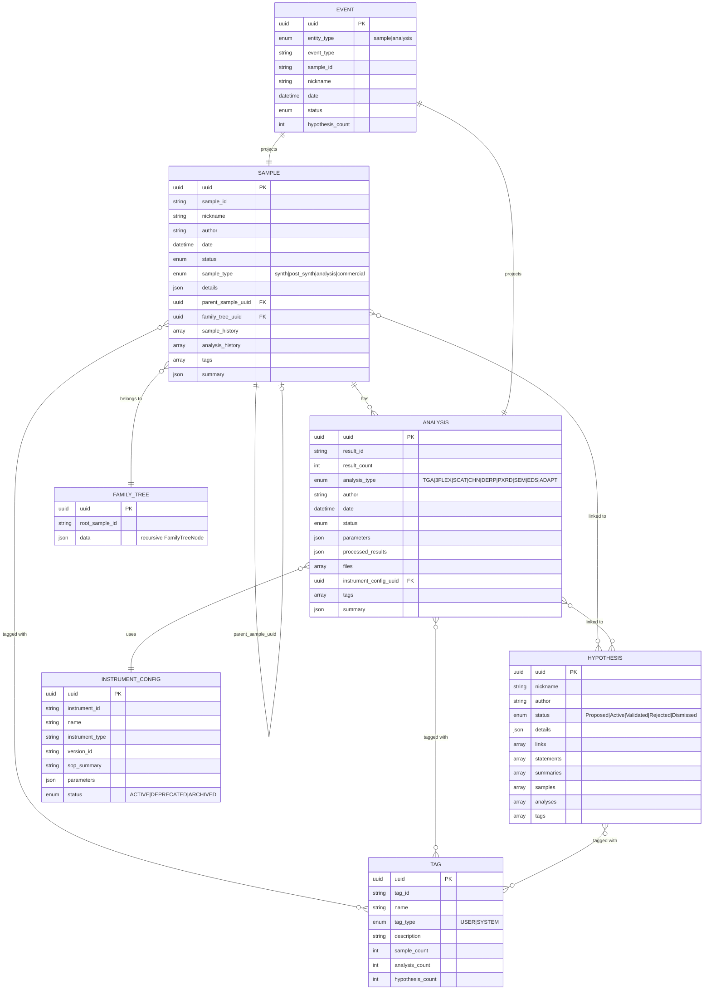

# Workflow Graph Studio (Prototype) — SPEC.md

> **Goal:** Bring the “any workflow is just a graph” value proposition to life with a local, self-serve prototype that turns **natural language** into a **typed workflow graph**, generates **realistic demo data**, and auto-renders a **polished UI** to manage and explore the workflow.

---

## 1) Product concept

### 1.1 One-sentence pitch
**Describe your workflow in plain English → get a working workflow app** (graph schema + seeded data + UI) in minutes.

### 1.2 Why this prototype exists
Your current scientific data management system already behaves like a graph: entities + relationships + events, with AI features that predict “what node/edge/property should come next.”  
This prototype demonstrates that the same approach can be generalized to **arbitrary workflow graphs** and delivered **self-serve**.

### 1.3 Primary success metric (prototype)
A new user can:
1) Describe a workflow in language,  
2) Receive a valid graph schema,  
3) Generate realistic dummy data,  
4) Use a polished UI to navigate the workflow and create/edit nodes,  
…all locally, without DynamoDB.

---

## 2) Scope

### 2.1 In-scope features (must-have)
- **Graph generation from language**
  - “Describe your workflow” → generates a typed workflow definition (node types, edge types, fields, states, UI hints).
  - Uses a strict JSON schema output with validation.
- **Library of graphs (templates)**
  - Ships with a template gallery including:
    - The provided *Sample–Analysis–Hypothesis* graph (below)
    - 3–5 additional example workflows (materials R&D loop, CAPA, ML lifecycle, sequencing provenance, etc.)
- **Realistic dummy data generation**
  - Schema-aware generator producing coherent graphs (linked nodes/edges, plausible metadata, timestamps, files).
  - Configurable scale (e.g., 50 samples / 200 analyses / 30 hypotheses).
- **Polished UI components**
  - Template Gallery + NL-to-Graph builder
  - Schema Designer (graph editor)
  - Instance Explorer (lists, filters, detail pages)
  - Graph Explorer (lineage + neighborhood)
  - Timeline (events)
  - Kanban/status board
  - Task queue / “next actions”
  - AI Assist side panel (suggestions + schema changes)
- **Ability to generate new nodes/properties**
  - Add new node types/fields/edges to the schema (manually or via AI)
  - Add new node instances (data) and properties from the UI
- **Local backend for data**
  - Runs fully locally (no DynamoDB).
  - Local persistence for schemas + instances + events.
  - Simple “reset database / reseed” controls.

### 2.2 Out of scope (for prototype)
- Production-grade multi-tenant auth/SSO, enterprise RBAC
- Real instrument integrations / file pipelines
- Heavy-duty graph analytics at scale
- Full migration engine across schema versions (we’ll do lightweight versioning)
- Highly optimized performance for millions of nodes

---

## 3) Personas & demo stories

### 3.1 Personas
- **Scientist / Operator:** Wants a workflow app that fits their process; doesn’t want to code.
- **Workflow Owner / Manager:** Wants dashboards, statuses, and “what’s blocked?” visibility.
- **Platform Builder (your team):** Wants a general engine to power many workflows.

### 3.2 “Wow demo” script (what the prototype should enable)
1) Open **Template Gallery** → click “Materials R&D: Samples → Analyses → Hypotheses”
2) Click **Generate Demo Data** → choose “Medium” scale → seconds later the app feels populated
3) Open a **Sample** → see lineage, linked analyses, linked hypotheses, tags, timeline
4) Switch to **Graph Explorer** → expand neighborhood, highlight paths, filter by edge type
5) Ask AI: “Add a ‘Calibration’ step before SEM analyses”  
   → schema updates, UI updates, dummy data generator can optionally backfill calibrations
6) Create a new **Analysis** from the Sample page → form is auto-generated from schema
7) Open **Kanban** → drag items across statuses; events appear in timeline

---

## 4) Core concepts & definitions

### 4.1 Two graphs, one product
The product works with:
- **Schema Graph (Workflow Definition):** node types, edge types, fields, states, rules, UI hints.
- **Instance Graph (Workflow Data):** node instances, edge instances, events, files.

### 4.2 Typed property graph model
- **Node:** `{ id, workflowId, type, title, status, properties (JSON), createdAt, updatedAt }`
- **Edge:** `{ id, workflowId, type, fromNodeId, toNodeId, properties (JSON), createdAt }`
- **Event:** `{ id, workflowId, subjectNodeId, eventType, payload (JSON), createdAt }`

> This is deliberately generic so *any* workflow can be expressed, including your current architecture.

---

## 5) Workflow Definition (schema) format

### 5.1 WorkflowDefinition JSON (canonical)
A workflow definition is stored as JSON with strong validation. Minimum fields:

```json
{
  "workflowId": "materials_rnd_v1",
  "name": "Materials R&D Workflow",
  "description": "Samples, analyses, and hypotheses with lineage and tags.",
  "nodeTypes": [
    {
      "type": "Sample",
      "displayName": "Sample",
      "titleField": "nickname",
      "fields": [
        {"key": "sample_id", "label": "Sample ID", "kind": "string", "required": true, "unique": true},
        {"key": "nickname", "label": "Nickname", "kind": "string"},
        {"key": "author", "label": "Author", "kind": "person"},
        {"key": "date", "label": "Date", "kind": "datetime"},
        {"key": "sample_type", "label": "Type", "kind": "enum", "values": ["synth","post_synth","analysis","commercial"]},
        {"key": "details", "label": "Details", "kind": "json"},
        {"key": "tags", "label": "Tags", "kind": "tag[]"}
      ],
      "states": {
        "enabled": true,
        "initial": "Draft",
        "values": ["Draft","In Progress","Complete","Archived"],
        "transitions": [
          {"from": "Draft", "to": "In Progress"},
          {"from": "In Progress", "to": "Complete"},
          {"from": "Complete", "to": "Archived"}
        ]
      },
      "ui": {
        "defaultViews": ["list","detail","graph","timeline"],
        "primarySections": ["summary","relationships","files","events"]
      }
    }
  ],
  "edgeTypes": [
    {"type": "HAS_ANALYSIS", "displayName": "has", "from": "Sample", "to": "Analysis", "direction": "out"},
    {"type": "LINKED_TO_HYPOTHESIS", "displayName": "linked to", "from": "Sample", "to": "Hypothesis", "direction": "out"}
  ],
  "rules": [
    {
      "id": "sample_requires_analysis_before_complete",
      "when": {"nodeType": "Sample", "transitionTo": "Complete"},
      "requireEdges": [{"edgeType": "HAS_ANALYSIS", "minCount": 1}],
      "message": "A Sample must have at least 1 Analysis before it can be marked Complete."
    }
  ]
}
```

### 5.2 UI hints are first-class
The definition must include enough UI metadata to render a compelling app:
- `titleField` and optional `subtitleField`
- field grouping / ordering
- recommended list columns
- default relationship panels
- allowed quick actions (“Create Analysis”, “Link Hypothesis”)
- which views are enabled by default

---

## 6) Graph generation from language

### 6.1 User experience
A dedicated “Describe Workflow” page:
- Text box: “Describe your workflow…”
- Optional toggles:
  - “Prefer scientific terminology”
  - “Include states + approvals”
  - “Include tags + timeline”
- Output:
  - Generated schema graph preview (visual)
  - Generated JSON (inspectable)
  - “Apply” button to create workflow definition
  - “Refine” chat to iterate (“Rename node type”, “Add relationship”, “Add status”)

### 6.2 Generation pipeline (prototype)
1) **LLM/Generator** produces a `WorkflowDefinition` JSON conforming to a strict schema.
2) **Validator** checks:
   - unique node/edge type names
   - all edge endpoints refer to node types
   - field keys unique per node type
   - states/transition validity
3) **Auto-fix layer** (non-LLM):
   - normalize names to `SNAKE_CASE` or `PascalCase` as needed
   - infer missing title fields
   - add default `createdAt/updatedAt`, `status` if absent
4) **Preview renderer** draws the schema graph and flags issues.

### 6.3 LLM support options (prototype-friendly)
The prototype should support either:
- **Bring-your-own API key** (cloud LLM) — best quality
- **Local model via Ollama** (optional) — “offline demo mode”
- **No-LLM fallback**: a rules-based starter that produces a simple schema from detected nouns/verbs

> The app should run even without an LLM, but the “wow” comes from high-quality NL → schema.

### 6.4 Safety & determinism
- The model must output **structured JSON only**.
- The app should never execute arbitrary code from model output.
- Unknown field kinds are rejected; user must choose from allowed field kinds.

---

## 7) Library of graphs (templates)

### 7.1 Template Gallery
A polished gallery with cards:
- title, description, tags (R&D, QA, ML, Bio)
- “Use Template” → creates a workflow definition
- “Preview Graph” → modal with schema diagram + example data

### 7.2 Required templates
1) **Your provided workflow: “Samples–Analyses–Hypotheses”** *(included below)*
2) **CAPA / Investigation workflow**
3) **Sequencing provenance**
4) **ML lifecycle**
5) **Materials closed-loop optimization** (Goal → Hypothesis → Plan → Sample → Analysis → Model → Recommendation)

### 7.3 Template storage
- Stored locally as JSON in `/templates/*.workflow.json`
- On first run, templates are imported into the local DB (so users can clone and edit)

---

## 8) Realistic dummy data generation

### 8.1 Requirements
- Must produce **coherent graphs**, not random disconnected nodes.
- Must respect schema:
  - required fields
  - enum values
  - unique constraints
  - edge constraints (if configured)
- Should feel “scientifically real”:
  - plausible IDs, authors, dates
  - analysis types and parameters
  - summaries that reference nearby nodes
  - tags that cluster meaningfully

### 8.2 Generator design
A two-stage generator:

**Stage A — Graph shape**
- Generates a connected instance graph using a “scenario recipe”:
  - number of roots, branching factor, depth
  - distributions per node type (e.g., 1 Sample → 2–5 Analyses)
  - optional lineage edges (parent/child)
  - optional many-to-many hypothesis links

**Stage B — Field values**
- Field-type-based generation:
  - `string`: Faker-like text, domain-specific patterns
  - `enum`: weighted selection
  - `person`: choose from a seeded roster (realistic repeated authors)
  - `datetime`: coherent timelines (e.g., analyses after sample creation)
  - `file[]`: create placeholder file metadata (and optional local dummy files)
  - `json`: generate structured blobs based on optional “schema” hints
  - `tag[]`: attach tags with controlled overlap

### 8.3 “Realism boosters”
- **Local LLM optional**: generate hypothesis statements/summaries grounded in nearby nodes
- **Correlated parameters**:
  - PXRD has `2theta_range`, `step_size`
  - SEM has `accelerating_voltage`, `detector`
- **Cohesive narratives**:
  - Hypotheses reference specific samples and analyses by nickname/ID

### 8.4 Demo controls
- “Generate Small / Medium / Large dataset”
- “Regenerate summaries” (if LLM enabled)
- “Reset demo” (wipe and reseed)

---

## 9) UI components (high excitement bar)

### 9.1 Top-level navigation
- **Home / Workflows**
- **Template Gallery**
- **Describe Workflow (AI)**
- **Schema Designer**
- **Data Explorer**
- **Graph Explorer**
- **Timeline**
- **Boards**
- **Admin / Settings**

### 9.2 Core UI screens

#### A) Describe Workflow (AI)
- Prompt area + examples
- Live schema preview (graph)
- Validation errors inline
- “Apply to create workflow”

#### B) Schema Designer (visual)
- Node type editor (fields, enums, states, UI hints)
- Edge type editor (source, target, cardinality, labels)
- Rule editor (“cannot transition unless…”, “require edge count”, etc.)
- Version save (“Save as v2”)

#### C) Data Explorer (lists + filters)
- Select node type (Sample/Analysis/…)
- Table with customizable columns
- Filters: status, author, tags, date range
- Search (title + selected fields)

#### D) Node Detail page (auto-generated)
- Header: Title, Status chip, Type, Created/Updated, Owner
- Tabs:
  - **Summary** (generated, editable)
  - **Properties** (form)
  - **Relationships** (panels by edge type, with “create/link” CTAs)
  - **Files** (attachments)
  - **Events** (audit timeline)
- Contextual actions:
  - “Create linked node” (e.g., Create Analysis)
  - “Link existing node”
  - “Suggest next step” (AI)

#### E) Graph Explorer
- Visual graph centered on a selected node
- Controls:
  - expand 1-hop / 2-hop
  - filter by edge type
  - highlight paths (source → target)
  - collapse/cluster by node type
- Side panel: selected node preview + quick actions

#### F) Timeline
- Event feed with filters:
  - node type, author, time range, event type
- Click event → open related node

#### G) Boards (Kanban)
- Choose node type and status field
- Drag-and-drop state transitions
- Optional swimlanes by tag/assignee

#### H) AI Assist panel (everywhere)
- Suggest:
  - titles, summaries
  - tags
  - next node creation (“Create SEM analysis with these parameters…”)
  - linking suggestions (“This hypothesis likely relates to these analyses…”)
- Schema change requests:
  - “Add field: ‘batch_number’ to Sample”
  - “Add node type: ‘ExperimentPlan’”
  - Changes are previewed + require explicit apply

### 9.3 Design system / polish requirements
- Use a modern component library and consistent styling
- Fast interactions (optimistic UI where safe)
- Smooth graph interactions (zoom, pan, minimap)
- Empty states that guide users ("Generate demo data")
- Strong demo defaults: the system looks alive immediately after seeding

### 9.4 Semantic View Templates
Declarative configurations that define how to traverse and render workflow subgraphs based on edge types. Each view template specifies:
- **Root type**: The node type this view starts from
- **Edge traversals**: Which edges to follow and in what direction
- **Level configurations**: How to render each node type level
- **Component styles**: Kanban, Cards, Tree, Timeline, or Table

#### Component Styles
- **Kanban**: Group nodes by a field (typically status), render as draggable columns
- **Cards**: Grid, list, single card, or inline chips layout
- **Tree**: Hierarchical expand/collapse with depth lines
- **Timeline**: Date-grouped events with connectors
- **Table**: Sortable, selectable data grid

#### View Template Schema
```json
{
  "id": "hypothesis-kanban",
  "name": "Hypothesis Board",
  "rootType": "Hypothesis",
  "edges": [],
  "levels": {
    "Hypothesis": {
      "style": "kanban",
      "styleConfig": {
        "groupByField": "status",
        "columnOrder": ["Proposed", "Active", "Validated", "Rejected"],
        "allowDrag": true,
        "cardTemplate": {
          "titleField": "nickname",
          "subtitleField": "author"
        }
      }
    }
  }
}
```

View templates are stored in `WorkflowDefinition.viewTemplates[]` alongside node types and edge types, allowing each workflow to define its own semantic views.

---

## 10) Ability to generate new nodes/properties

### 10.1 Schema-level creation
Users can:
- Add node types
- Add fields to node types (including enums)
- Add edge types (relationships)
- Add or edit status state machines
- Add rules/constraints

### 10.2 Instance-level creation
Users can:
- Create nodes of any node type
- Create edges via:
  - “link existing”
  - “create new linked”
  - drag-and-drop in graph explorer (optional)
- Add/edit arbitrary properties (within schema)
- Add files (local file attachments stored in a local folder + metadata in DB)

### 10.3 Schema evolution constraints (prototype)
- Schema changes create a new version
- Existing instances remain associated with the version they were created under
- Prototype supports a simple “upgrade instances to latest” for additive changes:
  - adding optional fields
  - adding new node types
  - adding new edge types
- Complex migrations out of scope

---

## 11) Local backend & persistence (no DynamoDB)

### 11.1 Default: SQLite (embedded, zero friction)
- Runs locally with a single file database: `data/workflow.db`
- Stores:
  - workflow definitions
  - node instances
  - edge instances
  - events
  - saved views

### 11.2 Optional: Postgres (docker-compose)
- For teams wanting “production-like” local setup:
  - JSONB for properties
  - stronger indexing
  - optional vector search with `pgvector`

### 11.3 Storage abstraction
Implement a backend interface so the prototype can swap storage engines:
- `GraphStore`:
  - `createWorkflow(definition)`
  - `listWorkflows()`
  - `createNode(node)`
  - `createEdge(edge)`
  - `getNode(id)`
  - `getNeighbors(id, filters)`
  - `queryNodes(filters, pagination)`
  - `appendEvent(event)`
  - `resetAndSeed(workflowId, recipe)`

### 11.4 File storage
- Local folder: `data/files/`
- DB stores file metadata + path
- UI supports attaching and previewing file metadata (and downloading)

---

## 12) Suggested prototype tech stack

### 12.1 Frontend
- **Next.js + TypeScript**
- UI kit: **shadcn/ui** (or equivalent) + Tailwind
- Graph rendering: **React Flow** (schema designer + graph explorer)
- Forms: JSON schema driven (custom renderer for nicer UX)
- State/data fetching: TanStack Query

### 12.2 Backend (local)
Choose one:

**Option A (JS stack):**
- Node.js + Fastify/Express
- Prisma ORM
- SQLite (default) / Postgres (optional)

**Option B (Python stack):**
- FastAPI
- SQLModel/SQLAlchemy
- SQLite (default) / Postgres (optional)

> Either is fine; pick what your team moves fastest in. The key is schema-driven APIs.

### 12.3 AI integration
- Adapter interface:
  - `generateWorkflowDefinitionFromText(prompt, constraints)`
  - `suggestNextActions(contextSubgraph)`
  - `generateSummaries(nodes, neighborhood)`
- Providers:
  - Cloud LLM with user-provided API key
  - Local Ollama (optional)
- Strong JSON-schema validation on all model outputs

### 12.4 Search (optional but high impact)
- For prototype: SQLite FTS (or simple LIKE + indexes)
- Optional: OpenSearch or Postgres full-text
- Optional: vector search later (pgvector)

---

## 13) APIs (prototype)

### 13.1 Workflow & templates
- `GET /api/templates`
- `POST /api/workflows/from-template`
- `POST /api/workflows/from-language` *(LLM)*
- `GET /api/workflows`
- `GET /api/workflows/:workflowId`

### 13.2 Schema editing
- `PUT /api/workflows/:workflowId/definition`
- `POST /api/workflows/:workflowId/version` (create v2)

### 13.3 Instances
- `POST /api/workflows/:workflowId/nodes`
- `GET /api/workflows/:workflowId/nodes?type=Sample&status=...`
- `GET /api/workflows/:workflowId/nodes/:nodeId`
- `PATCH /api/workflows/:workflowId/nodes/:nodeId`
- `POST /api/workflows/:workflowId/edges`
- `GET /api/workflows/:workflowId/nodes/:nodeId/neighborhood?depth=1&edgeTypes=...`

### 13.4 Events & timeline
- `GET /api/workflows/:workflowId/events?nodeId=...&type=...`
- `POST /api/workflows/:workflowId/events`

### 13.5 Dummy data
- `POST /api/workflows/:workflowId/seed` with `{ recipe: "small|medium|large", options: {...} }`
- `POST /api/workflows/:workflowId/reset`

---

## 14) Data model (SQL-level)

### 14.1 Minimal schema
- `workflow_definitions`
  - `id`, `name`, `version`, `definition_json`, timestamps
- `nodes`
  - `id`, `workflow_id`, `type`, `title`, `status`, `properties_json`, timestamps
- `edges`
  - `id`, `workflow_id`, `type`, `from_node_id`, `to_node_id`, `properties_json`, timestamps
- `events`
  - `id`, `workflow_id`, `subject_node_id`, `event_type`, `payload_json`, `created_at`

### 14.2 Indexes (important for “snappy” UI)
- `nodes(workflow_id, type, status, updated_at)`
- `edges(workflow_id, from_node_id, type)`
- `edges(workflow_id, to_node_id, type)` (for reverse lookups)
- `events(workflow_id, subject_node_id, created_at)`

---

## 15) Implementation phases (no-timebox)

### Phase 1 — “Template → Data → UI”
- Local DB + node/edge/event storage
- Template Gallery with the provided workflow template
- Dummy data generator
- Data Explorer + Node Detail UI
- Graph Explorer (1-hop)

### Phase 2 — “Language → Schema”
- NL → WorkflowDefinition generation + validation + preview
- Schema Designer (edit node types/fields/edges)
- Apply schema updates (versioning)

### Phase 3 — “AI Assist everywhere”
- Suggest titles/summaries/tags
- Suggest next steps (create/link nodes)
- AI-driven schema edits (preview + apply)

### Phase 4 — “Polish & demo power”
- Boards (kanban)
- Timeline enhancements
- Saved views / dashboards
- Export/import workflows and demo datasets

---

## 16) Acceptance criteria (prototype “definition of done”)

### 16.1 Graph generation from language
- Given a text description, the system outputs a valid `WorkflowDefinition` JSON matching the schema.
- User can apply it to create a new workflow and see UI immediately.

### 16.2 Template library
- Gallery displays templates.
- Provided workflow template is included and works end-to-end.

### 16.3 Dummy data realism
- Seeding produces a connected graph with plausible IDs, dates, and metadata.
- Detail pages show meaningful relationship panels and timelines.

### 16.4 UI delight
- The app feels “alive” after seeding:
  - lists filled
  - relationships populated
  - graph explorer navigable
  - board view usable
- No raw JSON editing required for normal use.

### 16.5 Extensibility
- User can add a new node type and field, and immediately create instances of it in the UI.

### 16.6 Local-first
- Entire prototype runs with local persistence (SQLite by default).
- No DynamoDB required.

---

## 17) Appendix A — Provided workflow template

> The following is included as a built-in template in the library.

### 17.1 Entity relationship diagram (original)


### 17.2 How this maps into the generic platform
- Node types: `Sample`, `Analysis`, `Hypothesis`, `Tag`, `InstrumentConfig`, `FamilyTree`, `Event`
- Edge types:
  - `HAS_ANALYSIS`: Sample → Analysis
  - `LINKS_HYPOTHESIS`: Sample → Hypothesis
  - `LINKS_HYPOTHESIS`: Analysis → Hypothesis
  - `TAGGED_WITH`: Sample/Analysis/Hypothesis → Tag
  - `PARENT_OF`: Sample → Sample
  - `BELONGS_TO_TREE`: Sample → FamilyTree
  - `USES_CONFIG`: Analysis → InstrumentConfig
  - `PROJECTS_SAMPLE`: Event → Sample
  - `PROJECTS_ANALYSIS`: Event → Analysis

> In the prototype, `FamilyTree` can also be treated as a **projection** generated from parent-child edges, but we include it as a first-class template element to match your current design.

---

## 18) Appendix B — Additional template ideas (placeholders)

- **CAPA / Investigation**
  - Nonconformance → Investigation → RootCause → CAPAAction → Verification
- **Sequencing Provenance**
  - BioSample → PrepStep → Run → Analysis → Result → QCReport
- **ML Lifecycle**
  - Dataset → FeatureSet → TrainingRun → ModelArtifact → Evaluation → Deployment
- **Closed-loop Optimization**
  - Goal → Hypothesis → ExperimentPlan → Sample → Measurement → Model → Recommendation

---

## 19) Appendix C — Example language prompts

### Prompt 1
“Scientists create samples, then run PXRD and SEM analyses. They can attach files. Analyses link back to hypotheses. Samples have parent/child lineage. Everything is tagged and has a status.”

Expected output:
- Node types: Sample, Analysis, Hypothesis, Tag
- Edge types: HAS_ANALYSIS, LINKED_TO_HYPOTHESIS, PARENT_OF, TAGGED_WITH
- State machines for Sample and Analysis
- UI hints: Sample detail page shows linked analyses + lineage + hypotheses panels

### Prompt 2
“We do CAPA: a nonconformance triggers an investigation, which may produce one or more corrective actions. Actions must be verified before closure.”

Expected output:
- Node types: Nonconformance, Investigation, Action, Verification
- Edge types: TRIGGERS, PRODUCES, VERIFIED_BY
- Rule: cannot close Nonconformance unless at least one Action is Verified

---

**End of SPEC.md**
