<script type="module">
  import mermaid from 'https://cdn.jsdelivr.net/npm/mermaid@10/dist/mermaid.esm.min.mjs';
  mermaid.initialize({ startOnLoad: false, theme: 'neutral' });

  document.addEventListener('DOMContentLoaded', async () => {
    // Find all mermaid code blocks
    const codeBlocks = document.querySelectorAll('pre code.language-mermaid');
    codeBlocks.forEach(block => {
      const pre = block.parentElement;
      const div = document.createElement('div');
      div.className = 'mermaid';
      div.textContent = block.textContent;
      pre.replaceWith(div);
    });
    await mermaid.run();
  });
</script>

# Curie Omni

**Building heterogeneous workflows through context graphs and agentic transformation**

---

## The Challenge: Scaling Beyond Single-Purpose Tools

Curie demonstrates that purpose-built workflow tools can dramatically accelerate scientific research. But every new domain—materials science, drug discovery, clinical trials—requires building a new tool from scratch.

We ask ourselves: **How do we build just one tool, to enable agentic capabilities across ALL workflows?**

Instead of building N separate tools for N workflows, we wanted to build a single system where:

- **Features benefit many workflows**: A better Kanban view or state machine helps everyone
- **Heterogeneity is a design principle**: Workflows differ wildly, and that's fine
- **Team effort decouples from value growth**: The platform gets smarter without linear engineering time

The result is **Curie Omni**—a prototype demonstrating that "any workflow is just a graph."

---

## Core Insight: Context Graphs as DAGs

The key realisation is that workflows, regardless of domain, share a common structure: **directed graphs of typed nodes connected by typed edges**.

### Two Graphs, One System

Every workflow in our system consists of two complementary graphs:

| Graph | Purpose | Example |
|-------|---------|---------|
| **Schema Graph** | Defines what's *possible*—node types, edge types, field definitions, state machines | "A Sample can have Analyses. Analyses can be Complete or Failed." |
| **Instance Graph** | Holds what *exists*—actual nodes, edges, and events | "Sample S-001 has Analysis A-042, which is Complete." |

### Anatomy of a Context Graph

**Schema Graph** — defines what's possible:


**Instance Graph** — holds what exists:


### Node Types Define Structure

Each node type in the schema specifies:

- **Fields**: Typed properties (`string`, `number`, `datetime`, `enum`, `person`, `json`, `tag[]`, `file[]`)
- **States**: Optional state machine with allowed transitions
- **UI Hints**: Quick actions, colors, display preferences

```json
{
  "id": "Sample",
  "name": "Sample",
  "fields": [
    {"id": "sample_id", "name": "Sample ID", "kind": "string", "required": true},
    {"id": "created_date", "name": "Date Created", "kind": "datetime"},
    {"id": "sample_type", "name": "Type", "kind": "enum",
     "options": ["synth", "post_synth", "analysis", "commercial"]}
  ],
  "states": {
    "enabled": true,
    "initial": "Draft",
    "values": ["Draft", "In Progress", "Complete", "Archived"],
    "transitions": [
      {"from": "Draft", "to": "In Progress"},
      {"from": "In Progress", "to": "Complete"},
      {"from": "Complete", "to": "Archived"}
    ]
  }
}
```

### Edge Types Define Relationships

Edges are first-class citizens with their own properties:

```json
{
  "id": "HAS_ANALYSIS",
  "name": "Has Analysis",
  "from": "Sample",
  "to": "Analysis",
  "properties": [
    {"id": "performed_by", "name": "Performed By", "kind": "person"}
  ]
}
```

---

## Agentic Transformer: Teaching the Platform to Learn

The second core component is the **Agentic Transformer**—a system that uses Claude SDK agents in a validation loop to generate transformation code.

### Why Transformation Matters

Functions are the most important abstraction in programming, given a particular input, reliably produce some kind of output. 
Coding agents have drastically reduced the amount of oversight required to generate even complex data transformations, which would otherwise have taken
engineers hours to days to create and validate. 
A recent paradigm is the creation of so called "Ralph Wiggum" (yes from the Simpsons), loops, where an agent is repeatedly called until some validation
threshold has passed. This is where agents shine the most, rigorously define what the success criteria are, and then let it find its own way.

The ability to learn functions greatly reduces the amount of customisation that is required to onboard any new workflow, which inevitably come with 
their own bespoke input formats, 3rd party data systems and other challenges. This context fragmentation is a fact of life, and a major blocker for 
greater uptake of AI for other types of knowledge work.

Rather than our developers writing one-off scripts, the Agentic Transformer:

1. **Takes instructions in natural language**: "Import samples from this spreadsheet"
2. **Explores the input**: Reads files, queries APIs, understands structure
3. **Generates transformation code**: Python scripts that produce valid output
4. **Validates**: Pydantic models catch errors before they propagate, as well as any custom validation code or even LLM as judge patterns
5. **Optionally learns**: Saves reusable skills for future runs

### The Validation Loop

```mermaid
flowchart TB
    subgraph Transformer["Agentic Transformer"]
        Input["📁 Input Files"]
        Agent["🤖 Claude Agent"]
        Code["transform.py<br/><small>(generated)</small>"]
        Execute["⚡ Execute"]

        subgraph Validation["Multi-Layer Validation"]
            Schema["Schema<br/><small>(Pydantic)</small>"]
            Custom["Custom<br/><small>(optional)</small>"]
            LLM["LLM-as-Judge<br/><small>(optional)</small>"]
        end

        Output["📤 Output JSON"]

        Input --> Agent
        Agent --> Code
        Code --> Execute
        Execute --> Schema
        Schema -.-> Custom
        Custom -.-> LLM
        Schema -->|"❌ errors"| Agent
        LLM -->|"❌ errors"| Agent
        LLM -->|"✅ valid"| Output
        Schema -->|"✅ valid"| Output
    end

    style Input fill:#e3f2fd
    style Agent fill:#fff3e0
    style Code fill:#f3e5f5
    style Execute fill:#e8f5e9
    style Validation fill:#fce4ec
    style Output fill:#c8e6c9
    style Custom fill:#fff,stroke-dasharray: 5 5
    style LLM fill:#fff,stroke-dasharray: 5 5
```



The validation pipeline supports three layers:

1. **Schema validation** (Pydantic): Structural correctness—types, required fields, enum values
2. **Custom validators** *(optional)*: Domain-specific rules—e.g., "analysis date must be after sample creation"
3. **LLM-as-judge** *(optional)*: Semantic validation—e.g., "does this hypothesis text make scientific sense?"


### Learning Mode

When `--learn` is enabled, the transformer saves:

- `transform.py`: The generated transformation script
- `SKILL.md`: Documentation for reuse

On subsequent runs with similar instructions, the system can replay the transformation without agent involvement—**proving it learned**.

---

## Demo: Graph Representations

### Generating Graphs from Natural Language

Describe what you want in plain English, and the system generates a complete workflow schema.


**What's happening:**
1. User describes workflow: "I want to track chemical synthesis experiments with samples, analyses, and hypotheses"
2. LLM generates `WorkflowDefinition` with node types, edges, states
3. System validates the schema
4. User previews the generated structure before creating

### Multiple Views from One Graph

The same instance graph renders in different views—each optimized for different tasks.


**Supported View Styles:**

| Style | Use Case |
|-------|----------|
| **Kanban** | Status-based workflows, drag-and-drop |
| **Table** | Data analysis, sorting, filtering |
| **Timeline** | Chronological tracking |
| **Tree** | Hierarchical relationships (sample lineage) |
| **Gantt** | Project planning with durations |
| **Cards** | Visual browsing |
| **Record** | Master-detail exploration |

### Business Logic: State Machines in Action

State machines enforce workflow rules—like "a Sample needs at least one Analysis before completion."


**How it works:**

1. User tries to mark Sample as "Complete"
2. System checks rules: `requireEdges: [{"edgeType": "HAS_ANALYSIS", "minCount": 1}]`
3. If no Analysis exists → transition blocked with helpful message
4. User adds Analysis → transition succeeds

### AI-Powered Node Generation

Graphs unlock a powerful pattern for AI: **prediction becomes graph-conditioned generation**.


The insight is simple but profound. Given any node, we can:

1. **Extract its neighborhood**: Traverse edges to gather related nodes
2. **Build context**: Serialize the local subgraph into a prompt
3. **Generate**: Ask an LLM to produce something conditioned on that context

This pattern generalizes across domains:

| Use Case | Neighborhood | Generation |
|----------|--------------|------------|
| **Suggest next experiment** | Previous samples + their analyses + outcomes | New Sample node with parameters |
| **Generate readable nickname** | Parent samples + analysis types + key results | Human-friendly identifier like "High-Temp-TGA-Batch-3" |
| **Draft hypothesis** | Related samples + anomalous analysis results | Hypothesis node with rationale |
| **Recommend analysis** | Sample properties + similar samples' successful analyses | Analysis node with suggested parameters |

The abstraction is domain-agnostic:

```
generate(
  context = neighborhood(node, depth=2),
  output = NodeType | FieldValue
)
```

Whether you're doing materials science, drug discovery, or project management, the same machinery applies. The graph structure tells the model what's relevant; the schema constrains what's valid.

---

## Demo: Agentic Transformers

### Learning Endpoints

The transformer allows us to expose an API which is learned from user requests. This allows external services to **push** data into the graph, e.g.
from laboratory equipment, testing rigs, etc., in a permissionless way.


**The process:**

1. Provide an example input to the transformer, in json format, including any keys that indicate how matching / upserting may occur
2. Provide instructions in natural language for the intended effect and output type
3. Transformer loops, performing data analysis, doing research on how to do this, until the constraints are satisfied
4. Instance graph delta is provided to user
5. Once confirmed, the learned transformer code is stored for that endpoint, and this is now a repeatable user-generated API route

The key insight: successful validation **proves** the connector works. There's no gap between "code that looks right" and "code that works."

### Learning Connectors

The graph also needs to **pull** information from various 3rd party sources. The transformer allows the system to learn how to connect to any 3rd party
system - agents are trivially able to write this type of code. 


**The process:**

The transformer:
1. Provide the transformer with urls of external assets, e.g. a wandb link, as well as any secrets required (which are stored in encrypted storage)
2. Provide instructions in natural language for the desired output types
3. Transformer loops, reading API documentation on the web, writing transformation code, until the constraints are sastified.
4. User confirms that the output is correct
5. The system can now connect this data source to any node, and the graph will pull in the context for any AI operations

TBD - 3rd party pull graph automation, e.g. pull list of projects periodically, create nodes for each new run.

---

## Chat: Graph-Native Context Building

Chat is now a first-class feature in modern applications. But making chat useful requires giving the model relevant context—and this is where graphs shine.


### The Problem with Traditional Approaches

In relational databases, building context for an LLM is painful:

```sql
-- "What analyses have been run on samples related to hypothesis H-007?"
SELECT a.* FROM analyses a
JOIN sample_analyses sa ON a.id = sa.analysis_id
JOIN samples s ON sa.sample_id = s.id
JOIN sample_hypotheses sh ON s.id = sh.sample_id
WHERE sh.hypothesis_id = 'H-007'
-- Plus: figure out which tables exist, what the join keys are,
-- handle nullable foreign keys, deal with many-to-many tables...
```

Every query requires understanding the schema, writing correct joins, and handling edge cases. This complexity multiplies across domains—each new workflow means new tables and new join patterns.

### Graph Traversal as Context Assembly

With graphs, context building becomes declarative traversal:

```python
# Same question, graph approach:
context = graph.traverse(
    start="H-007",
    edges=["LINKED_TO_HYPOTHESIS", "HAS_ANALYSIS"],
    depth=2
)
```

The agent doesn't need to know about join tables or foreign keys. It just walks the graph.

### Why This Matters for Chat

When a user asks a question, the agent can:

1. **Identify relevant starting nodes** from the question
2. **Traverse the graph** to gather related context
3. **Serialize the subgraph** into the prompt
4. **Generate a grounded response** based on actual data

This works regardless of domain. A materials science workflow and a hiring pipeline use the same traversal machinery—only the node and edge types differ.

```
User: "Why did we reject hypothesis H-007?"

Agent internally:
1. Find node H-007 (type: Hypothesis, status: Rejected)
2. Traverse LINKED_TO_HYPOTHESIS edges → find related Samples
3. Traverse HAS_ANALYSIS edges → find their Analyses
4. Include rejection_reason field from H-007
5. Generate response grounded in this context
```

The graph structure makes context assembly systematic rather than bespoke.

---

## Architecture Summary

```mermaid
flowchart TB
    subgraph UI["User Interface"]
        Kanban["Kanban"]
        Table["Table"]
        Timeline["Timeline"]
        Tree["Tree"]
        More["..."]
    end

    subgraph Renderer["View Renderer"]
        VR["Traverses graph according to ViewTemplate config"]
    end

    subgraph GraphLayer["Graph Layer"]
        subgraph Schema["Schema Graph"]
            NT["NodeTypes"]
            ET["EdgeTypes"]
            Rules["Rules"]
            VT["ViewTemplates"]
        end
        subgraph Instance["Instance Graph"]
            Nodes["Node instances"]
            Edges["Edge instances"]
            Events["Events"]
        end
        RulesEngine["Rules Engine<br/><small>Enforces state transitions & constraints</small>"]
    end

    subgraph TransformerLayer["Agentic Transformer"]
        External["External Data<br/><small>Notion · Drive · Excel · APIs</small>"]
        Agent["Claude Agent"]
        Validator["Validator<br/><small>Pydantic + Custom</small>"]
    end

    Kanban & Table & Timeline & Tree & More --> VR
    VR --> Schema
    VR --> Instance
    Instance --> RulesEngine
    Schema --> RulesEngine

    External --> Agent
    Agent --> Validator
    Validator -->|"valid"| Instance

    style UI fill:#e3f2fd
    style Renderer fill:#fff3e0
    style GraphLayer fill:#e8f5e9
    style TransformerLayer fill:#fce4ec
```



---

## What's Missing: Workflow Orchestration

This prototype handles **workflow representation**—but not yet **workflow execution**. The gap is significant.

### The Representation vs. Execution Gap

Currently, we can:
- Define what states nodes can be in
- Specify which transitions are valid
- Enforce rules that block invalid transitions

But we cannot yet:
- Define **processes** that prescribe how work should flow
- Automatically **trigger actions** when graph state changes
- Assign **tasks** to humans or agents based on process state

### Process Definitions: Prescribing Work

A **process definition** describes a desired flow of state changes through the graph:

```yaml
process: "Sample Analysis Pipeline"
steps:
  - name: "Create Sample"
    creates: { type: Sample, status: Draft }
    assignee: human | agent

  - name: "Run Initial Analysis"
    requires: { type: Sample, status: "In Progress" }
    creates: { type: Analysis, edge: HAS_ANALYSIS }
    assignee: agent  # AI can trigger instrument

  - name: "Review Results"
    requires: { type: Analysis, status: Complete }
    transitions: { Sample: "In Progress" → "Complete" }
    assignee: human  # Human reviews before sign-off
```

Each step prescribes:
- **What must exist** before the step can run (preconditions)
- **What gets created or changed** when the step executes (effects)
- **Who handles it**: a human or an agent

### Event-Driven Orchestration

The key architectural addition is **reactive execution**: every graph edit triggers evaluation of process state.

```mermaid
flowchart LR
    subgraph Triggers["Graph Events"]
        NodeCreated["Node created"]
        StatusChanged["Status changed"]
        EdgeAdded["Edge added"]
    end

    subgraph Engine["Process Engine"]
        Evaluate["Evaluate<br/>Processes"]
    end

    subgraph Actions["Triggered Actions"]
        Human["👤 Create human task"]
        Agent["🤖 Invoke agent"]
        Notify["📧 Send notification"]
        External["🔗 Trigger external system"]
    end

    NodeCreated & StatusChanged & EdgeAdded --> Evaluate
    Evaluate --> Human & Agent & Notify & External

    style Triggers fill:#e3f2fd
    style Engine fill:#fff3e0
    style Actions fill:#e8f5e9
```



### Multiple Processes, One Graph

A single graph can have multiple process definitions running concurrently:

| Process | Concern | Operates On |
|---------|---------|-------------|
| **Sample Pipeline** | Core experimental flow | Sample → Analysis → Complete |
| **Quality Review** | Compliance checking | Any node entering "Complete" |
| **Hypothesis Validation** | Scientific method | Hypothesis + supporting Analyses |

Each process has its own state machine dynamics, but they share the same underlying graph. A Sample completing its pipeline might simultaneously trigger a quality review process and update hypothesis validation state.

### Human-Agent Task Allocation

The process engine assigns tasks based on step configuration:

```
Step: "Review anomalous results"
  condition: Analysis.result contains anomaly flag
  assignee: human
  → Creates task in human's queue

Step: "Run follow-up TGA analysis"
  condition: Previous analysis suggests thermal decomposition
  assignee: agent
  → Agent receives instruction, triggers instrument, creates Analysis node
```

This is workflow orchestration in the true sense: not just representing work, but **driving it forward** through a combination of human judgment and agent automation.

### Why This Matters

Without execution, we have a very nice data structure. With execution, we have a system that:

- **Guides users** through complex multi-step processes
- **Automates routine steps** while keeping humans in the loop for judgment calls
- **Tracks progress** across concurrent processes
- **Enforces process compliance** through the same rule engine that enforces state validity

The graph representation makes this possible—but the execution engine makes it useful. 

This takes us one step closer to our goal of multi-scale technology development!

---

*Built by the Reactivy team. For questions or collaboration opportunities, reach out at [team@reactivy.io](mailto:team@reactivy.io).*
